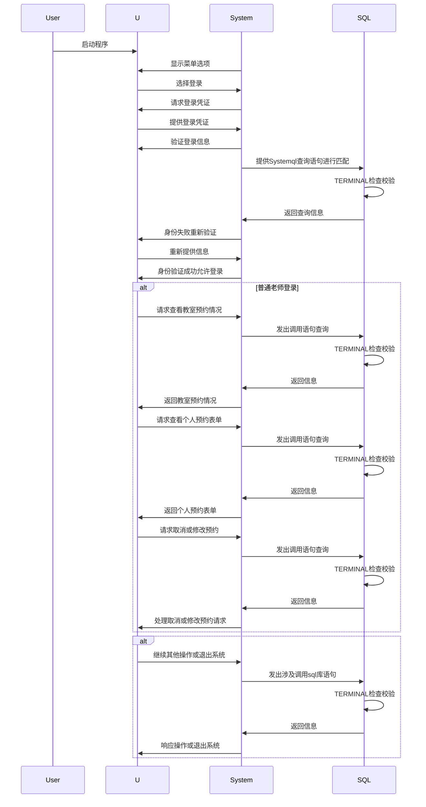
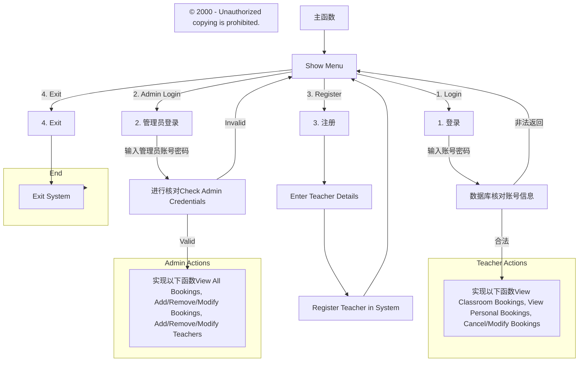

这是什么？失忆喷雾喷一下！
哈咯大家好~
这是一个简单的 C++项目，主要用于教师预约和管理员管理。
中间也出现过不少困难，本来打算利用 GITHUB 完成多人项目开发，但是时间紧任务重，最后也就做了一半吧。
遇到 clion 和 mysql 链接报错，可以在这里找到答案：
[clion 安装](https://blog.csdn.net/qq_44723773/article/details/104698675)
[连接 Mysql](https://blog.csdn.net/Szyangc/article/details/122096343)
[找不到 sql.h](https://blog.csdn.net/flaystar/article/details/105768129)
[my.ini 文件配置](https://blog.csdn.net/Burnup_110/article/details/115079157)
[找不到 my.ini 文件](https://blog.csdn.net/jiangyu1013/article/details/79792708)
[mysql 命令行闪退](https://blog.csdn.net/weixin_47678894/article/details/122737182)

## 教室管理系统序列图

管理员这部分长度不让放了，所以删去了，有兴趣自己画
# 教室管理系统流程图

## 流程图

